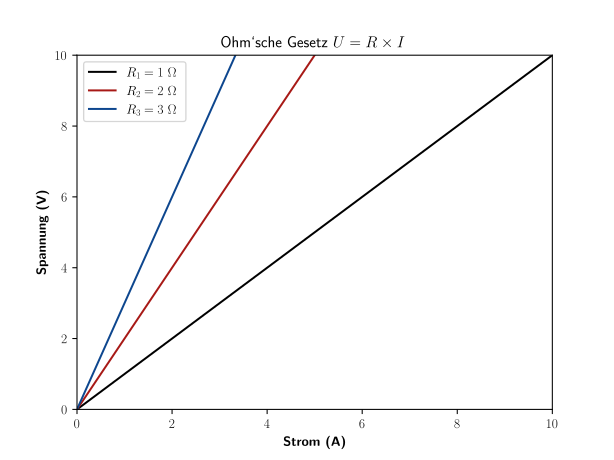

<!--update 30-7-23 Ohm‘sche Gesetz-->

# Ohm‘sche Gesetz

```python
# Quellcode in Python
import math
import matplotlib 
matplotlib.rcParams['text.usetex'] = True # Latex code
import matplotlib.pyplot as plt 

R1 = 1 # Ohm
R2 = 2 # Ohm
R3 = 3 # Ohm
N=500 
X=[x / 10 for x in range(N)] # Ampere
Y1=[R1 * i for i in X]  # Spannung
Y2=[R2 * i for i in X]  # Spannung
Y3=[R3 * i for i in X]  # Spannung


# Latex
# Farben: Orange #F28C64 und grau2 #B2B2B2
plt.plot(X,Y1, label=r'$R_1 = 1~\Omega$', color="black")
plt.plot(X,Y2, label=r'$R_2 = 2~\Omega$', color="#A71916")#rot5 #A71916
plt.plot(X,Y3, label=r'$R_3 = 3~\Omega$', color="#0D468E")#blau5 #0D468E
plt.title(r'Ohmsche Gesetz $U = R \times I$',fontsize=12)
plt.xlabel(r'\textbf{Strom (A)}')
plt.ylabel(r'\textbf{Spannung (V)}')
plt.xlim(0,+10) 
plt.ylim(0,+10)
plt.legend()
plt.savefig("Diag_Ohmsche_Gesetz.svg")
plt.show()
```


<!--{width=75%}-->  


