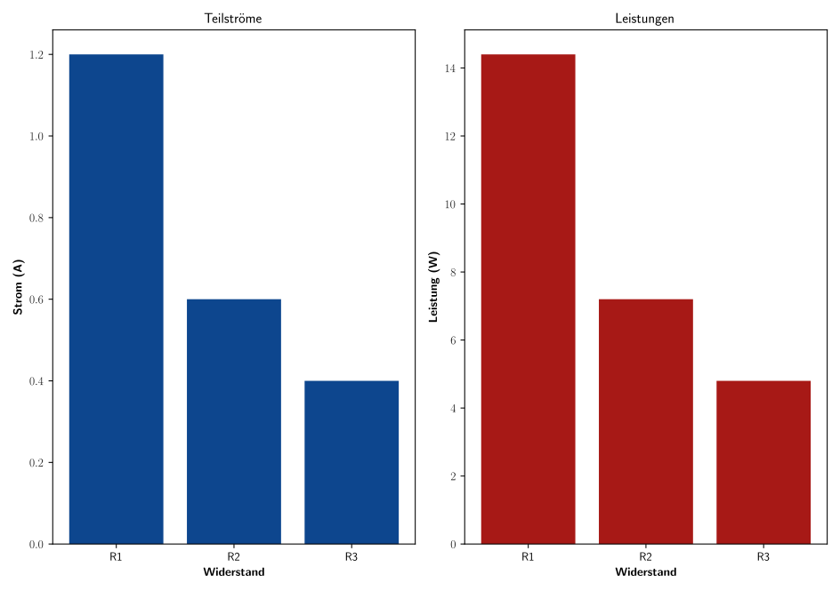

<!--update 30-7-23 Parallelschaltung in Python-->
# Parallelschaltung

**Aufgabenstellung: Elektrische Eigenschaften einer Parallelschaltung von Widerständen**

**Teil A:** 
Entwickle ein Python-Programm, das die elektrischen Eigenschaften einer Parallelschaltung von drei Widerständen berechnet.

**Eingabe:** 
Drei Widerstandswerte in Ohm und eine Spannungsquelle von 12 V.

**Gesuchte Ausgaben:**

- Teilströme über jeden Widerstand.
- Gesamtstrom durch die Schaltung.
- Gesamtleistung der Schaltung.
- Leistung über jeden Widerstand.
- Gesamtwiderstand der Schaltung.

Nutze das Modul `matplotlib` für Python, um die Ergebnisse grafisch darzustellen. Teste dein Programm anschließend mit drei exemplarischen Widerstandswerten.

**Teil B:** 
Erläutere die Berechnungen für eine Parallelschaltung von Widerständen mit Hilfe von Markdown.

**Inhalt:**

- Beschreibung der gegebenen Werte und der gesuchten Größen.
- Manuelle Berechnung der oben genannten Größen.
- Darstellung der Parallelschaltung mit Hilfe eines einfachen ASCII-Schaltplans.

Verwende die gegebenen Formeln und Lösungen, um die Teile A und B entsprechend auszuarbeiten.

**Schaltplan**

```
       +--R1--+
       |      |
+12V---+--R2--+---GND
       |      |
       +--R3--+
```

\newpage
**Python-Code zur Berechnung und grafischen Darstellung**


```python
# Quellcode in Python
import matplotlib.pyplot as plt
import matplotlib 
matplotlib.rcParams['text.usetex'] = True # Latex code

# Funktion zur Berechnung der Werte für eine Parallelschaltung
def parallelschaltung(R1, R2, R3, U):
    # Berechnung des Gesamtwiderstands
    R_ges = 1 / (1/R1 + 1/R2 + 1/R3)
    # Teilströme berechnen
    I1 = U / R1
    I2 = U / R2
    I3 = U / R3
    # Gesamtstrom
    I_ges = I1 + I2 + I3
    # Leistungen berechnen
    P_ges = U * I_ges
    P1 = U * I1
    P2 = U * I2
    P3 = U * I3
    return I1, I2, I3, I_ges, P_ges, P1, P2, P3, R_ges

# Testwerte
R1 = 10  # Ohm
R2 = 20  # Ohm
R3 = 30  # Ohm
U = 12   # Volt

I1, I2, I3, I_ges, P_ges, P1, P2, P3, R_ges = parallelschaltung(R1, R2, R3, U)

# Ausgabe der berechneten Werte
print(f"Teilstrom über R1, I1 = {I1:.2f} A")
print(f"Teilstrom über R2, I2 = {I2:.2f} A")
print(f"Teilstrom über R3, I3 = {I3:.2f} A")
print(f"Gesamtstrom, I_ges = {I_ges:.2f} A")
print(f"Gesamtleistung, P_ges = {P_ges:.2f} W")
print(f"Leistung über R1, P1 = {P1:.2f} W")
print(f"Leistung über R2, P2 = {P2:.2f} W")
print(f"Leistung über R3, P3 = {P3:.2f} W")
print(f"Gesamtwiderstand, R_ges = {R_ges:.2f} Ohm")

# Grafische Darstellung
widerstaende = ["R1", "R2", "R3"]
teilstroeme = [I1, I2, I3]
leistungen = [P1, P2, P3]

# Farbe: Orange #F28C64 grau2 #B2B2B2 rot5 #A71916 blau5 #0D468E
plt.figure(figsize=(250/25.4, 176/25.4))  # Größe in inches (B5 format: 250mm x 176mm)plt.figure(figsize=(12, 5))
plt.subplot(1, 2, 1)
plt.bar(widerstaende, teilstroeme, color='#0D468E')#blau5 #0D468E
plt.title(r'Teilströme',fontsize=12)#
plt.ylabel(r'\textbf{Strom (A)}')
plt.xlabel(r'\textbf{Widerstand}')
plt.subplot(1, 2, 2)
plt.bar(widerstaende, leistungen, color='#A71916')#rot5 #A71916
plt.title(r'Leistungen',fontsize=12)#
plt.ylabel(r'\textbf{Leistung (W)}')
plt.xlabel(r'\textbf{Widerstand}')
plt.tight_layout()
plt.savefig("Diag_Parallelschaltung.svg")# SVG-Vektorgrafik
plt.show()
```

**Programmberechnung**

```python
# Ausgabe Quellcode:
Teilstrom über R1, I1 = 1.20 A
Teilstrom über R2, I2 = 0.60 A
Teilstrom über R3, I3 = 0.40 A
Gesamtstrom, I_ges = 2.20 A
Gesamtleistung, P_ges = 26.40 W
Leistung über R1, P1 = 14.40 W
Leistung über R2, P2 = 7.20 W
Leistung über R3, P3 = 4.80 W
Gesamtwiderstand, R_ges = 5.45 Ohm
```

{width=50%}
<!--{width=70%}-->    
    

\newpage
**Berechnung**

**Gegebene Werte:**

- $R_1 = 10~\Omega$
- $R_2 = 20~\Omega$
- $R_3 = 30~\Omega$
- $U = 12~V$

**Gesamtwiderstand der Parallelschaltung:**

- $\frac{1}{R_{ges}} = \frac{1}{R_1} + \frac{1}{R_2} + \frac{1}{R_3} = \frac{1}{10} + \frac{1}{20} + \frac{1}{30} = 0.1833$

- Daraus ergibt sich: $R_{ges} = \frac{1}{0.1833} = 5.46~\Omega$

**Teilströme:**

- $I_1 = \frac{U}{R_1} = \frac{12}{10} = 1.2~A$
- $I_2 = \frac{U}{R_2} = \frac{12}{20} = 0.6~A$
- $I_3 = \frac{U}{R_3} = \frac{12}{30} = 0.4~A$

**Gesamtstrom:**

- $I_{ges} = I_1 + I_2 + I_3 = 1.2 + 0.6 + 0.4 = 2.2~A$

**Leistung über jeden Widerstand:**

- $P_1 = U \times I_1 = 12 \times 1.2 = 14.4~W$
- $P_2 = U \times I_2 = 12 \times 0.6 = 7.2~W$
- $P_3 = U \times I_3 = 12 \times 0.4 = 4.8~W$

**Gesamtleistung:**

- $P_{ges} = U \times I_{ges} = 12 \times 2.2 = 26.4~W$

**Ergebnisse:**

- Gesamtwiderstand, $R_{ges} = 5.46~\Omega$
- Teilstrom über $R_1, I_1 = 1.2~A$
- Teilstrom über $R_2, I_2 = 0.6~A$
- Teilstrom über $R_3, I_3 = 0.4~A$
- Gesamtstrom, $I_{ges} = 2.2~A$
- Leistung über $R_1, P_1 = 14.4~W$
- Leistung über $R_2, P_2 = 7.2~W$
- Leistung über $R_3, P_3 = 4.8~W$
- Gesamtleistung, $P_{ges} = 26.4~W$

