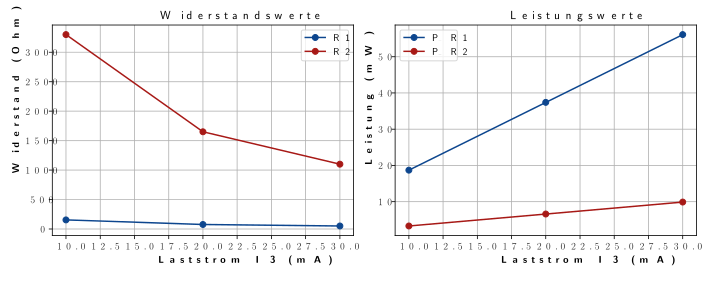

<!--update 30-7-23 belasteter Spannungsteiler-->
# belasteter Spannungsteiler

**Aufgabenstellung: Untersuchung eines belasteten Spannungsteilers bei unterschiedlichen Lastströmen**

**Teil A:** 
Entwickeln Sie ein Python-Programm zur Analyse eines belasteten Spannungsteilers, der mit verschiedenen Lastströmen konfrontiert wird.

**Beschreibung der Schaltung:** 
Ein Spannungsteiler besteht aus zwei Widerständen, $R_1$ und $R_2$, die in Reihe geschaltet sind. Am Übergang zwischen $R_1$ und $R_2$, dem Ausgangspunkt, ist ein Lastwiderstand $R_{\text{Last}}$ angeschlossen. Die Schaltung wird durch eine Eingangsspannung $U_{\text{in}} = 5 \, \text{V}$ gespeist. Am Lastwiderstand liegt eine Spannung von $U_{\text{Last}} = 3,3 \, \text{V}$ an. Der Strom $I_2$, der durch $R_2$ fließt, beträgt konstant 10% des Laststroms $I_3$.

**Analyseziele:**  

a) **Bestimmen Sie die Widerstandswerte $R_1$ und $R_2$ basierend auf den gegebenen Verhältnissen von $I_2$ zu $I_3$.**  
b) **Für verschiedene Lastströme $I_3$, berechnen Sie die Ströme $I_1$ und $I_2$. Die Ergebnisse sollen in mA dargestellt werden.**  
c) **Ermitteln Sie die Leistungen, die an $R_1$ und $R_2$ abfallen, mittels der Formel $P = U^2/R$. Die Leistungen sollten in mW angegeben werden.**  
d) **Bewerten Sie, ob 1/4-Watt-Widerstände für $R_1$ und $R_2$ unter den gegebenen Lastbedingungen geeignet sind.**

Implementieren Sie die Ergebnisse mittels einer grafischen Darstellung in Python mit `matplotlib`. Testen Sie Ihr Programm mit den Lastströmen 10 mA, 20 mA und 30 mA.

**Teil B:** 
Erläutern Sie die Funktionsweise und die Berechnungen eines belasteten Spannungsteilers ausführlich und nutzen Sie dabei die Markdown-Sprache.

**Erforderliche Inhalte:**  

- Skizzieren Sie den Schaltplan und erläutern Sie das Grundprinzip des belasteten Spannungsteilers.
- Zeigen Sie die notwendigen Berechnungen systematisch auf und präsentieren Sie die Resultate.
- Visualisieren Sie die Schaltung mit einem geeigneten Schaltbild, z.B. einem ASCII-Schaltbild.

```python
# Schaltplan: Belasteter Spannungsteiler
+Uin o-+---------------------
       |
      [R1]
       |
       +------+--o Uout 
       |      |
       |      o
      [R2] [R_Last] 10mA, 20mA, 30mA
       |      o
       |      |
 GND o-+------+-------------
```

\newpage
**Python-Code zur Berechnung

```python
# Quellcode in Python
import matplotlib.pyplot as plt
import matplotlib 
matplotlib.rcParams['text.usetex'] = True # Latex code

# Gegebene Werte
U_in = 5  # Eingangsspannung in V
U_Last = 3.3  # Spannung an R_Last in V

# Lastströme in A
I_3_values_A = [0.01, 0.02, 0.03]  # 10mA, 20mA, 30mA
# Lastströme in mA zur Beschriftung der x-Achse
I_3_values_mA = [10, 20, 30]

# Listen für die Ergebnisse
R1_values = []
R2_values = []
P_R1_values = []
P_R2_values = []

# Berechnung für jeden Laststrom
for I_3 in I_3_values_A:
    I_2 = 0.1 * I_3
    I_1 = I_3 + I_2 
    R_2 = U_Last / I_2
    R_1 = (U_in - U_Last) / I_1
    P_R1 = (U_in - U_Last)**2 / R_1
    P_R2 = U_Last**2 / R_2
    R1_values.append(R_1)
    R2_values.append(R_2)
    P_R1_values.append(P_R1*1000)  # Umwandlung in mW
    P_R2_values.append(P_R2*1000)  # Umwandlung in mW

# Plotten der Ergebnisse
# Farbe: Orange #F28C64 grau2 #B2B2B2 rot5 #A71916 blau5 #0D468E
plt.figure(figsize=(250/25.4, 176/25.4))  # Größe in inches (B5 format: 250mm x 176mm)

# Widerstandswerte
plt.subplot(2, 2, 1)
plt.plot(I_3_values_mA, R1_values, label="R1", marker='o', color='#0D468E')
plt.plot(I_3_values_mA, R2_values, label="R2", marker='o', color='#A71916')
plt.xlabel(r"\textbf{Laststrom I_3 (mA)}")
plt.ylabel(r"\textbf{Widerstand (Ohm)}")
plt.title(r"Widerstandswerte",fontsize=12)
plt.legend()
plt.grid(True)

# Leistungswerte
plt.subplot(2, 2, 2)
plt.plot(I_3_values_mA, P_R1_values, label="P_R1", marker='o', color='#0D468E')
plt.plot(I_3_values_mA, P_R2_values, label="P_R2", marker='o', color='#A71916')
plt.xlabel(r"\textbf{Laststrom I_3 (mA)}")
plt.ylabel(r"\textbf{Leistung (mW)}")
plt.title(r"Leistungswerte",fontsize=12)
plt.legend()
plt.grid(True)
plt.tight_layout()
plt.savefig("Diag_belasteter_Spannungsteiler.svg")# SVG-Vektorgrafik
plt.show()
```


    
<!--{width=85%}--> 
    

\newpage
**Grundprinzip des belasteten Spannungsteilers:**

Ein Spannungsteiler besteht im Grunde aus zwei Widerständen in Reihe, zwischen denen die Spannung aufgeteilt wird. Bei Anwendung einer Last ändert sich die Spannungsaufteilung und die Stromverhältnisse entsprechend der Größe der Last.

**Schaltbild:**

```python
+5V
 |
 R1
 |
 +----> Ausgang (3V3) Lastströme: Werte 10 mA, 20 mA und 30 mA
 |
 R2
 |
 GND
```

**Berechnung**

Gegebene Werte:

- $U_{in} = 5V$
- $U_{Last} = 3.3V$
- $I_2$ ist 10% von $I_3$
- Formeln: 
  - $R_2 = \frac{U_{Last}}{I_2}$
  - $R_1 = \frac{U_{in} - U_{Last}}{I_1}$
  - $P_{R1} = \frac{(U_{in} - U_{Last})^2}{R_1}$
  - $P_{R2} = \frac{U_{Last}^2}{R_2}$

Für $I_3 = 10mA$:
$I_2 = 0.1 \times 10mA = 1mA$
$I_1 = 11mA$

$R_2 = \frac{3.3V}{1mA} = 3.3k\Omega$
$R_1 = \frac{5V - 3.3V}{11mA} = 154.55\Omega \approx 155\Omega$

$P_{R1} = \frac{1.7^2}{155\Omega} = 18.71mW$
$P_{R2} = \frac{3.3^2}{3.3k\Omega} = 3.3mW$

Für $I_3 = 20mA$:
$I_2 = 2mA$
$I_1 = 22mA$

$R_2 = \frac{3.3V}{2mA} = 1.65k\Omega$
$R_1 = \frac{1.7V}{22mA} = 77.27\Omega \approx 77\Omega$

$P_{R1} = \frac{1.7^2}{77\Omega} = 37.42mW$
$P_{R2} = \frac{3.3^2}{1.65k\Omega} = 6.6mW$

Für $I_3 = 30mA$:
$I_2 = 3mA$
$I_1 = 33mA$

$R_2 = \frac{3.3V}{3mA} = 1.1k\Omega$
$R_1 = \frac{1.7V}{33mA} = 51.52\Omega \approx 52\Omega$

$P_{R1} = \frac{1.7^2}{52\Omega} = 55.63mW$
$P_{R2} = \frac{3.3^2}{1.1k\Omega} = 9.9mW$

